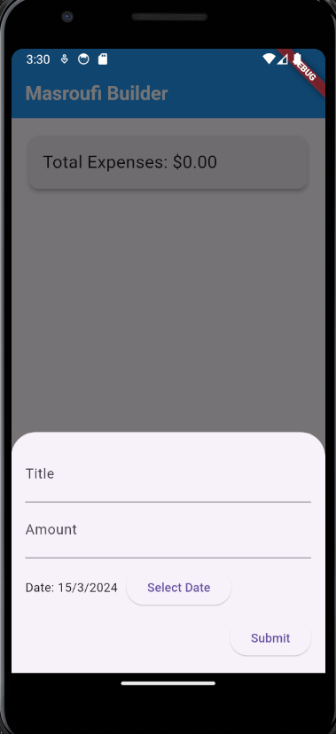

# Expense Tracker App

## Description:
The Expense Tracker app is a simple Flutter application designed to help users track their expenses. It provides a user-friendly interface for adding, viewing, and managing individual expenses.

## Features:
- **Add new expenses:** Users can add new expenses by providing a title, amount, and date.
- **View total expenses:** The app displays the total amount of all expenses.
- **Delete expenses:** Users can delete individual expenses from the list.

## Installation:
To run the Expense Tracker app locally, follow these steps:
1. Ensure you have Flutter installed. If not, follow the instructions on the [Flutter website](https://flutter.dev/docs/get-started/install).
2. Clone this repository to your local machine.
3. Navigate to the project directory in your terminal.
4. Run `flutter pub get` to install dependencies.
5. Connect a device or start an emulator.
6. Run `flutter run` to launch the app on your device or emulator.

## Usage:
- Upon launching the app, you will see the main screen displaying total expenses and a list of individual expenses.
- Tap the floating action button to add a new expense.
- Enter the title, amount, and date for the new expense in the bottom sheet that appears.
- Tap "Submit" to add the expense to the list.
- To delete an expense, tap the trash icon next to the expense in the list.

## Dependencies:
The Expense Tracker app uses the following dependencies:
- `flutter_hooks`: Provides hooks for Flutter applications, used for state management and enhanced widget functionality.
- `cupertino_icons`: Provides iOS-style icons for the app.

## Screenshots:

*Caption for Screenshot 1*

*Caption for Screenshot 2*

*Caption for Screenshot 3*
